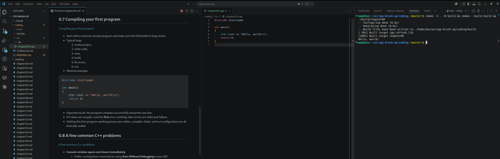

# C++ brush up

Repo to help you quickly refresh you C++ coding skills using [Learn C++](https://learncpp.com/).

## How to use

### IDE

We recommend using VS Code. Open a chapter**.md in preview mode. Create the respective chapter**.cpp. Apply what you learned.

Add ms-vscode.cpptools for debugging in VS Code.
```
code --install-extension ms-vscode.cpptools
```



### Coding / Compilation

Linux
```bash
cd coding
clear && cmake -S . -B build && cmake --build build && ./build/chapter00
```

Windows
```powershell
cd coding
clear; cmake -S . -B build; cmake --build build --config Release; .\build\Release\chapter01.exe
```

### Debugging chapter03 with gdb

Linux
```bash
cd coding
cmake -S . -B build -DCMAKE_BUILD_TYPE=Debug && cmake --build build && gdb ./build/chapter04
```

Windows (MinGW + gdb)
```powershell
cd coding
cmake -S . -B build -G "MinGW Makefiles" -DCMAKE_BUILD_TYPE=Debug; cmake --build build; gdb .\build\chapter03.exe
```

### Debugging chapter03 with VS code
Linux
1. Open file
2. Click left of line number to add break point bubble
3. Press 'F5' to run compilation and start debugging
  - .vscode/tasks.json — cmake debug build task
  - .vscode/launch.json — "Debug chapter03" config (F5)
4. Press `Ctrl Shift D` to see Run & Debug view
